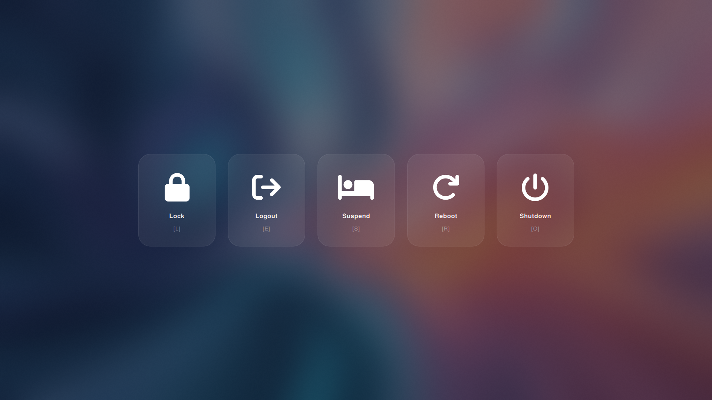

<div align="center">

# Hobbyist dotfiles
**Beautifully crafted desktop rice for Arch Linux**


<br>

</div>

## MangoWM
> [MangoWM](https://github.com/mangowm/mango) is as lightweight as dwl and can be built completely within a few seconds. Despite this, Mango does not compromise on functionality.

## Niri
> [Niri](https://github.com/YaLTeR/niri) is a scrollable-tiling Wayland compositor written in Rust. It offers a unique approach to window management compared to traditional tiling compositors.

## Hyprland
> [Hyprland](https://github.com/hyprwm/Hyprland) is an independent, highly customizable, dynamic tiling Wayland compositor without sacrificing its looks.

## DriftWM
> [DriftWM](https://github.com/malbiruk/driftwm) is a trackpad-first infinite canvas Wayland compositor.

## Qtile
> `No longer maintained` `Skill issue` [Qtile](https://github.com/qtile/qtile/) is a full-featured, hackable tiling window manager written and configured in Python

### Curious about what it looks like? Here's a glimpse.

|      **Desktop & Status Bar**      |
| :--------------------------------: |
|  |

|        **App launcher**         |
| :-----------------------------: |
|    |
|  |

|          **Clipboard history**          |
| :-------------------------------------: |
|  |

|            **Wallpaper picker**             |
| :-----------------------------------------: |
|  |

|                 **Power menu**                 |
| :--------------------------------------------: |
|             |
|  |

|                **Screenlock**                 |
| :-------------------------------------------: |
|          |
|  |

|              **Fastfetch**              |
| :-------------------------------------: |
|  |


## Components

> This setup uses the following applications and tools:

|     **Category**      | **Application**                                         | **Description**                                                                                                             |
| :-------------------: | :------------------------------------------------------ | :-------------------------------------------------------------------------------------------------------------------------- |
|  **Window Manager**   | [MangoWM](https://github.com/mangowm/mango)             | Practical and powerful Wayland compositor (dwm but Wayland)                                                                 |
|                       | [Niri](https://github.com/niri-wm/niri)                 | A scrollable-tiling Wayland compositor.                                                                                     |
|                       | [Hyprland](https://github.com/hyprwm/Hyprland)          | Highly customizable dynamic tiling Wayland compositor.                                                                      |
|                       | [DriftWM](https://github.com/malbiruk/driftwm)          | A trackpad-first infinite canvas Wayland compositor.                                                                        |
|                       | [Qtile](https://github.com/qtile/qtile/)                | A full-featured, hackable tiling window manager written and configured in Python `No longer maintained` `Skill issue`       |
|    **Status Bar**     | [Waybar](https://github.com/Alexays/Waybar)             | Highly customizable modular status bar.                                                                                     |
|    **Info fetch**     | [Fastfetch](https://github.com/fastfetch-cli/fastfetch) | Fastfetch is a neofetch-like tool for fetching system information                                                           |
| **Wallpaper Manager** | [swaybg](https://github.com/swaywm/swaybg)              | Wallpaper tool for Wayland compositors.                                                                                     |
|     **Terminal**      | [Foot](https://codeberg.org/dnkl/foot)                  | A fast, lightweight and minimalistic Wayland terminal emulator                                                              |                           |
|                       | [Kitty](https://github.com/kovidgoyal/kitty)            | Fast, feature-rich, GPU-based terminal emulator.                                                                            |
|       **Shell**       | [Fish](https://fishshell.com/)                          | User-friendly command line shell.                                                                                           |
|      **Editor**       | [Neovim](https://neovim.io/)                            | Neovim is a modern, fast and feature-rich editor that is fully compatible with Vim. Powered by [NvChad](https://nvchad.com) |
|     **Launcher**      | [Rofi](https://github.com/davatorium/rofi)              | Window switcher, application launcher, and dmenu replacement.                                                               |
|  **System Monitor**   | [Btop](https://github.com/aristocratos/btop)            | A monitor of resources.                                                                                                     |
|   **File Manager**    | [Yazi](https://github.com/sxyazi/yazi)                  | Blazing-fast terminal file manager written in Rust.                                                                         |
|   **Notifications**   | [Mako](https://github.com/emersion/mako)                | Lightweight notification daemon.                                                                                            |
|    **Lock Screen**    | [Hyprlock](https://github.com/hyprwm/hyprlock/)         | Hyprland's GPU-accelerated screen locking utility.                                                                          |
|    **Logout Menu**    | [Wlogout](https://github.com/ArtsyMacaw/wlogout)        | Wayland-based logout menu.                                                                                                  |
|   **Media Player**    | [MPV](https://mpv.io/)                                  | Video player with `modernz` script.                                                                                         |
| **Audio Visualizer**  | [Cava](https://github.com/karlstav/cava)                | Console-based audio visualizer.                                                                                             |

## Essential Keybindings

> These keybindings are consistent across all listed Wayland compositors. Check each compositor's config file for the full list.

| **Key Combination**                               | **Action**                 |
| :------------------------------------------------ | :------------------------- |
| <kbd>Super</kbd> + <kbd>T</kbd>                   | Open Terminal (`Kitty`)    |
| <kbd>Super</kbd> + <kbd>Space</kbd>               | Open App Launcher (`Rofi`) |
| <kbd>Super</kbd> + <kbd>Q</kbd>                   | Quit focused window        |
| <kbd>Super</kbd> + <kbd>B</kbd>                   | Open Browser (`Librewolf`) |
| <kbd>Super</kbd> + <kbd>N</kbd>                   | Open File Manager (`Yazi`) |
| <kbd>Super</kbd> + <kbd>P</kbd>                   | Power Menu (`Wlogout`)     |
| <kbd>Super</kbd> + <kbd>Ctrl</kbd> + <kbd>E</kbd> | Exit Wayland compositor    |

## Installation

> [!IMPORTANT]
> Please review the [pkglist](Configs/installed-pkg/pkglist.txt) before executing install.sh so you have an idea of what will be installed. By default, you will get Niri and Hyprland, with Niri set as the default session.

> [!WARNING]
> The Installation script uses [GNU Stow](https://www.gnu.org/software/stow/) under the hood, so do **not** delete or move `~/hobbyist-dotfiles/`, otherwise all Stow-based symlinks will break.

### Prerequisites
- Clean Arch Linux (recommended) or an Arch-based distro (e.g. EndeavourOS, Manjaro)

```bash
sudo pacman -Syu --needed --noconfirm git
```
```bash
cd ~ && git clone https://github.com/BlackSparkz/hobbyist-dotfiles.git
```
```bash
bash ~/hobbyist-dotfiles/install.sh
```
### One-liner
```bash
sudo pacman -Syu --needed --noconfirm git && cd ~ && git clone https://github.com/BlackSparkz/hobbyist-dotfiles.git && bash ~/hobbyist-dotfiles/install.sh
```

### Stow conflicts

If GNU Stow reports conflicts, use the helper directly:

```bash
bash ~/hobbyist-dotfiles/stow-configs.sh --dry-run
```

```bash
bash ~/hobbyist-dotfiles/stow-configs.sh --backup-conflicts
```

```bash
bash ~/hobbyist-dotfiles/stow-configs.sh --adopt
```

`--adopt` can overwrite existing files, so only use it when you intend to merge local state into the repo.

## Structure

<!-- TREE_START -->
```
Configs/
├── alacritty
│   └── alacritty.toml
├── bash
│   └── bashrc
├── bat
│   └── config
├── btop
│   ├── themes
│   └── btop.conf
├── cava
│   ├── shaders
│   │   ├── bar_spectrum.frag
│   │   ├── eye_of_phi.frag
│   │   ├── northern_lights.frag
│   │   ├── pass_through.vert
│   │   ├── spectrogram.frag
│   │   └── winamp_line_style_spectrum.frag
│   ├── themes
│   │   ├── solarized_dark
│   │   └── tricolor
│   └── config
├── cmus
│   ├── playlists
│   │   └── Default
│   ├── autosave
│   ├── cache
│   ├── command-history
│   ├── lib.pl
│   ├── rc
│   └── search-history
├── driftwm
│   └── config.toml
├── fastfetch
│   ├── Arch.png
│   └── config.jsonc
├── fish
│   ├── functions
│   │   ├── cd.fish
│   │   ├── clean.fish
│   │   ├── fish_prompt.fish
│   │   ├── gacp.fish
│   │   ├── ydl.fish
│   │   └── y.fish
│   ├── config.fish
│   └── fish_variables
├── foot
│   ├── foot_for_smassh.ini
│   └── foot.ini
├── ghostty
│   └── config
├── gtk-3.0
│   └── settings.ini
├── gtk-4.0
│   └── settings.ini
├── hypr
│   ├── hyprland_modules
│   │   ├── Autostart.lua
│   │   ├── Gestures.lua
│   │   ├── Input.lua
│   │   ├── Keybinds.lua
│   │   ├── Look_and_feel.lua
│   │   ├── Misc.lua
│   │   ├── Monitors.lua
│   │   └── Rules.lua
│   ├── hyprlock_themes
│   │   ├── hyprlock_0.conf
│   │   └── hyprlock_1.conf
│   └── hyprland.lua
├── installed-pkg
│   └── pkglist.txt
├── kdedefaults
│   ├── kcminputrc
│   ├── kdeglobals
│   ├── ksplashrc
│   ├── kwinrc
│   ├── package
│   └── plasmarc
├── kitty
│   └── kitty.conf
├── klassy
│   ├── klassyrc
│   └── windecopresetsrc
├── lazygit
│   └── config.yml
├── mako
│   └── config
├── mango
│   ├── Animations.conf
│   ├── Autostart.conf
│   ├── Blur.conf
│   ├── config.conf
│   ├── Dwindle_layout.conf
│   ├── Environments.conf
│   ├── General.conf
│   ├── Keybinds.conf
│   ├── Master-Stack.conf
│   ├── Monitors.conf
│   ├── Rules.conf
│   ├── Scroller_layout.conf
│   ├── Shadows.conf
│   └── Tagrules.conf
├── mpv
│   ├── fonts
│   │   └── modernz-icons.ttf
│   ├── script-opts
│   │   ├── modernz.conf
│   │   └── modernz-locale.json
│   ├── scripts
│   │   └── modernz.lua
│   ├── input.conf
│   └── mpv.conf
├── niri
│   ├── Animations.kdl
│   ├── Autostart.kdl
│   ├── Blur.kdl
│   ├── config.kdl
│   ├── Cursor.kdl
│   ├── Input.kdl
│   ├── Keybinds.kdl
│   ├── Layout.kdl
│   ├── Others.kdl
│   ├── Outputs.kdl
│   ├── Overview.kdl
│   └── Rules.kdl
├── nvim
│   ├── lua
│   │   ├── configs
│   │   │   ├── conform.lua
│   │   │   ├── lazy.lua
│   │   │   └── lspconfig.lua
│   │   ├── plugins
│   │   │   └── init.lua
│   │   ├── autocmds.lua
│   │   ├── chadrc.lua
│   │   ├── mappings.lua
│   │   └── options.lua
│   ├── init.lua
│   ├── lazy-lock.json
│   └── .stylua.toml
├── qtile
│   └── config.py
├── quickshell
│   └── power_menu
│       └── shell.qml
├── Resources
│   ├── fonts
│   │   ├── Betterlett.ttf
│   │   ├── GoogleSansCodeNF-Bold.ttf
│   │   ├── GoogleSansCodeNF-Medium.ttf
│   │   ├── GoogleSansCodeNF-Regular.ttf
│   │   └── GoogleSansFlex-VariableFont_GRAD,ROND,opsz,slnt,wdth,wght.ttf
│   ├── images
│   │   ├── PFP.jpg
│   │   └── red_dots.png
│   └── walls_for_driftwm
│       └── pink_cloud.glsl
├── rofi
│   ├── clipboard.rasi
│   ├── config.rasi
│   ├── launchpad.rasi
│   └── wallpaper-selector.rasi
├── Scripts
│   ├── auto_detect_terminal.sh
│   ├── bashfix.sh
│   ├── clipboard.sh
│   ├── clipboard_toggle.sh
│   ├── dashboard.sh
│   ├── dashboard_toggle.sh
│   ├── full_screenshot.sh
│   ├── kde-send.sh
│   ├── launcher.sh
│   ├── launcher_toggle.sh
│   ├── lockscr_greet.sh
│   ├── mako-sound.sh
│   ├── mpris.sh
│   ├── partial_screenshot.sh
│   ├── powermenu.sh
│   ├── powermenu_toggle.sh
│   ├── random_wall_on_home.sh
│   ├── random_wall_on_lockscr.sh
│   ├── rofi_clipboard.sh
│   ├── rofi_powermenu.sh
│   ├── screen_recorder.sh
│   ├── smassh.sh
│   ├── structure_update.py
│   ├── wallpaper_switcher.sh
│   └── ydl.py
├── smassh
│   └── smassh.json
├── swayimg
│   └── init.lua
├── systemd
│   └── user
│       ├── default.target.wants
│       │   ├── mako-sound.service -> /home/blackspark/.config/systemd/user/mako-sound.service
│       │   └── niri.service -> /home/blackspark/.config/systemd/user/niri.service
│       ├── mako-sound.service
│       └── niri.service
├── waybar
│   ├── DriftWM
│   │   ├── config.jsonc
│   │   └── style.css
│   ├── Hyprland
│   │   └── config.jsonc
│   ├── MangoWM
│   │   └── config.jsonc
│   ├── Modules
│   │   ├── Backlight.jsonc
│   │   ├── Battery.jsonc
│   │   ├── Bluetooth.jsonc
│   │   ├── Center.jsonc
│   │   ├── Clock.jsonc
│   │   ├── Cpu.jsonc
│   │   ├── Disk.jsonc
│   │   ├── Memory.jsonc
│   │   ├── Mpris.jsonc
│   │   ├── Network.jsonc
│   │   ├── Power.jsonc
│   │   ├── Pulseaudio.jsonc
│   │   ├── Right.jsonc
│   │   ├── Temperature.jsonc
│   │   └── Tray.jsonc
│   ├── Niri
│   │   └── config.jsonc
│   └── style.css
├── wezterm
│   └── wezterm.lua
├── wlogout
│   ├── icons
│   │   ├── hibernate.png
│   │   ├── lock.png
│   │   ├── logout.png
│   │   ├── power.png
│   │   ├── restart.png
│   │   └── sleep.png
│   ├── layout
│   └── style.css
├── xsettingsd
│   └── xsettingsd.conf
├── yazi
│   ├── flavors
│   │   └── dracula.yazi
│   │       ├── flavor.toml
│   │       ├── LICENSE
│   │       ├── LICENSE-tmtheme
│   │       ├── preview.png
│   │       ├── README.md
│   │       └── tmtheme.xml
│   ├── plugins
│   │   └── full-border.yazi
│   │       ├── LICENSE
│   │       ├── main.lua
│   │       └── README.md
│   ├── init.lua
│   ├── keymap.toml
│   ├── package.toml
│   ├── theme.toml
│   └── yazi.toml
├── dolphinrc
├── kactivitymanagerdrc
├── kactivitymanagerd-statsrc
├── kcminputrc
├── kconf_updaterc
├── kded5rc
├── kdeglobals
├── kfontinstuirc
├── kglobalshortcutsrc
├── kiorc
├── klipperrc
├── kmenueditrc
├── kservicemenurc
├── ksmserverrc
├── ksplashrc
├── ktimezonedrc
├── ktrashrc
├── kwinoutputconfig.json
├── kwinrc
├── plasma-localerc
├── plasma-nm
├── plasma-org.kde.plasma.desktop-appletsrc
├── plasmaparc
├── plasmarc
├── plasmashellrc
└── powermanagementprofilesrc
```
<!-- TREE_END -->
